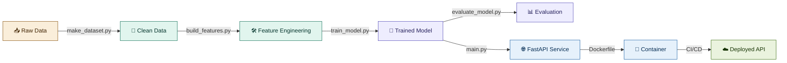

<div align="center">

# 🚀 End-to-End ML Pipeline

### Production-style machine learning, from raw data to a live API

[](https://www.python.org/)
[](https://fastapi.tiangolo.com/)
[](https://www.docker.com/)
[](https://scikit-learn.org/)

[](LICENSE)
[](../../actions)
[](../../commits/main)
[](../../stargazers)

**🔗 [Quick Start](#-quick-start) · [Architecture](#-architecture) · [API Docs](#-api-usage) · [Tech Stack](#-tech-stack)**

</div>

---

## 📌 Overview

> A complete, end-to-end machine learning system — not just a notebook.
> This project takes raw data all the way to a **live, containerized prediction API**, with testing and CI/CD built in.

🎯 **Problem statement:** Predict customer churn for a subscription-based business using historical customer data *(swap in your own dataset/problem — the pipeline is plug-and-play)*.

| | |
|---|---|
| 🗂️ **Stage** | Raw data → Clean data → Features → Trained model → Live API |
| 🧰 **Built for** | Portfolio projects, learning MLOps fundamentals, production templates |
| ⏱️ **Setup time** | ~10 minutes |
| 🩹 **Skill level** | Intermediate → Advanced |

---

## 🏗️ Architecture



*(GitHub renders Mermaid diagrams natively — this will show as a colored flowchart right in your repo 🎨)*

---

## 📁 Project Structure
```
ml-pipeline-project/
├── 📂 data/
│   ├── raw/                # Original, immutable data
│   └── processed/          # Cleaned, feature-engineered data
├── 📓 notebooks/              # EDA and experimentation (exploratory only)
├── 🧠 src/
│   ├── data/                # Data loading & ingestion scripts
│   │   └── make_dataset.py
│   ├── features/            # Feature engineering
│   │   └── build_features.py
│   ├── models/               # Training, prediction, evaluation
│   │   ├── train_model.py
│   │   ├── predict_model.py
│   │   └── evaluate_model.py
│   └── api/                  # FastAPI app for serving predictions
│       ├── main.py
│       └── schemas.py
├── 💾 models/                  # Saved/serialized trained models
├── 🧪 tests/                   # Unit tests
├── ⚙️ .github/workflows/       # CI/CD pipeline (GitHub Actions)
├── 🐳 Dockerfile
├── 🐳 docker-compose.yml
├── 📦 requirements.txt
├── 🔧 config.yaml              # Central config (paths, hyperparameters)
└── 📘 README.md
```

---

## ⚡ Quick Start

### 1️⃣ Clone & set up environment

```bash
# Clone repo
git clone https://github.com/sansa135/ml-pipeline-project.git
cd ml-pipeline-project

# Create virtual environment
python -m venv venv
source venv/bin/activate     # Windows: venv\Scripts\activate

# Install dependencies
pip install -r requirements.txt
```

### 2️⃣ Run the pipeline

| Step | Command | What it does |
|:---:|---|---|
| 📥 | `python src/data/make_dataset.py` | Loads & cleans raw data |
| 🛠️ | `python src/features/build_features.py` | Encodes & builds features |
| 🤖 | `python src/models/train_model.py` | Trains the model |
| 📊 | `python src/models/evaluate_model.py` | Prints accuracy, precision, recall, F1 |

### 3️⃣ Serve it as an API

```bash
uvicorn src.api.main:app --reload
```
🌐 Visit **http://127.0.0.1:8000/docs** for interactive Swagger documentation.

### 4️⃣ Or run it fully containerized 🐳

```bash
docker build -t ml-pipeline .
docker run -p 8000:8000 ml-pipeline
```

---

## 🔌 API Usage

<div align="center">

| Endpoint | Method | Description |
|---|:---:|---|
| `/` | GET | Health & model info |
| `/health` | GET | Liveness check |
| `/predict` | POST | Single prediction |
| `/predict/batch` | POST | Batch predictions |

</div>

**Example request:**
```bash
curl -X POST "http://127.0.0.1:8000/predict" \
     -H "Content-Type: application/json" \
     -d '{"feature_1": 0.5, "feature_2": 1.2, "feature_3": 3.4}'
```

**Example response:**
```json
{
  "prediction": 1,
  "probability": 0.87
}
```

---

## ✅ Testing

```bash
pytest tests/
```

## 🔁 CI/CD

GitHub Actions automatically lints and tests on every push — see the badge at the top of this README and `.github/workflows/ci.yml`. 🟢 green = good to merge.

---

## 🧰 Tech Stack

<div align="center">

| Layer | Tools |
|---|---|
| 🐍 **Language** | Python 3.11 |
| 📊 **Data / ML** | pandas, scikit-learn, joblib |
| 🌐 **API** | FastAPI, uvicorn, Pydantic |
| 🐳 **Containerization** | Docker, docker-compose |
| 🔁 **CI/CD** | GitHub Actions |
| 🧪 **Testing** | pytest |

</div>

---

## 🗺️ Roadmap

- [ ] Swap in a real dataset (Kaggle churn, fraud, etc.)
- [ ] Add model versioning (MLflow / DVC)
- [ ] Add monitoring & logging (Prometheus / Grafana)
- [ ] Deploy to cloud (Render, AWS, GCP)

---

## 📄 License

This project is licensed under the **MIT License** — see [LICENSE](LICENSE) for details.

<div align="center">

⭐ **If this helped you, consider starring the repo!** ⭐

Made with 🐍 + ☕ by [@sansa135](https://github.com/sansa135)

</div>
